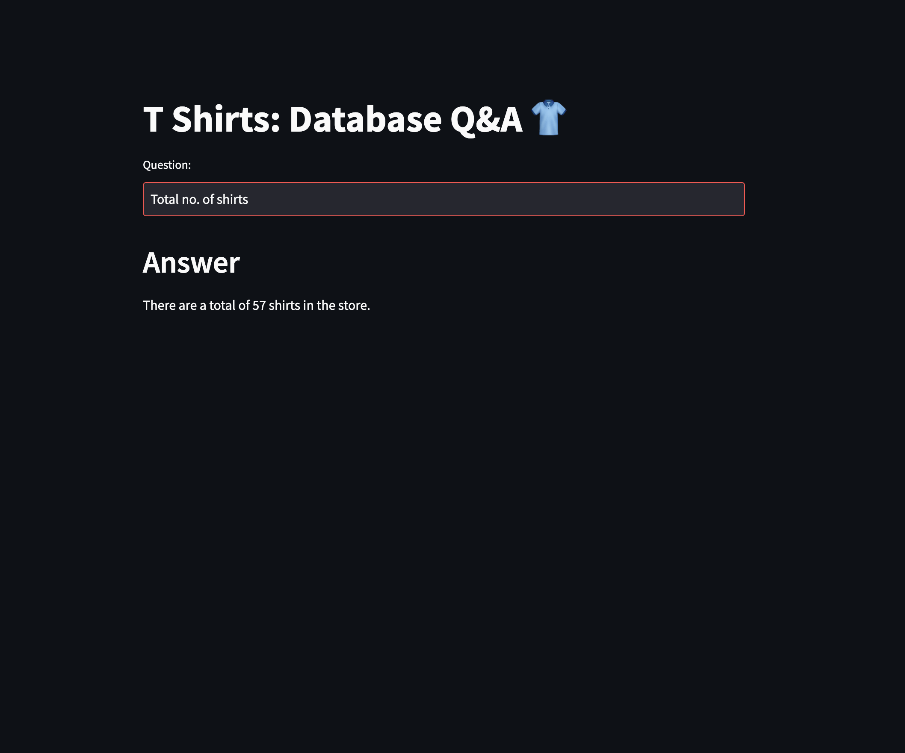

# 🧠 Text2SQL App — Natural Language to SQL using LangChain, HuggingFace & Ollama

This project allows users to ask **natural language questions** and get answers from a **MySQL database** by converting the questions into **SQL queries** using:

- **LangChain**
- **HuggingFace Embeddings**
- **Ollama LLMs (Qwen2)**

It uses few-shot learning, semantic similarity, and local LLM inference for a fast, secure, and intelligent querying experience.



---

## 📦 Key Python Packages Used

- `langchain-huggingface`
- `langchain-ollama`
- `langchain_community`
- `watchdog`
- `cryptography`
- `streamlit`
- `python-dotenv`

---

## 📁 Dataset & Embeddings

- The dataset (SQL schema + data) is located in `./dataset/db_creation_atliq_tshirts.sql`.
- We embed both the **schema** and its **content** using HuggingFace’s `"sentence-transformers/all-MiniLM-L6-v2"`.
- We have performed Few-shot training on LLM to train it on edge case queries.
- LLM used: **Qwen2** (running via [Ollama](https://ollama.com)).

---

## 🐬 Setting Up MySQL with Docker

### Step 1: Run MySQL Docker Container

```bash
docker run --name atliq-mysql \
  -e MYSQL_ROOT_PASSWORD=<password> \
  -e MYSQL_DATABASE=atliq_tshirts \
  -p 3306:3306 \
  -d mysql:8.0

```

### Step 2: Load Schema & Data into MySQL

```bash
docker cp ./dataset/db_creation_atliq_tshirts.sql atliq-mysql:/db_creation.sql
docker exec -it atliq-mysql bash
```

#### Inside the container:

```bash
mysql -u root -p
# Enter: root

USE atliq_tshirts;
SOURCE /db_creation.sql;
```

## ⚙️ Environment Setup

### Step 1: Clone the Repo

```bash
git clone https://github.com/your-username/text2sql.git
cd text2sql
```

### Step 2: Create & Activate Virtual Environment

```bash
python -m venv venv
source venv/bin/activate  # On Windows: venv\Scripts\activate
```

### 3. Install Dependencies

```bash
pip install -r requirements.txt
```

---

# 🔐 Create .env File

```bash
touch .env
```

#### Add the following:

```bash
DB_USER=<db user name>
DB_PASSWORD=<db password>
DB_HOST=<host name>
DB_PORT=3306
DB_NAME=atliq_tshirts

LLM_MODEL_NAME=<model name>
LLM_MODEL_TEMP=<model temp>
LLM_BASE_URL=<llm base url>

EMBEDDING_MODEL_NAME=sentence-transformers/all-MiniLM-L6-v2
```
